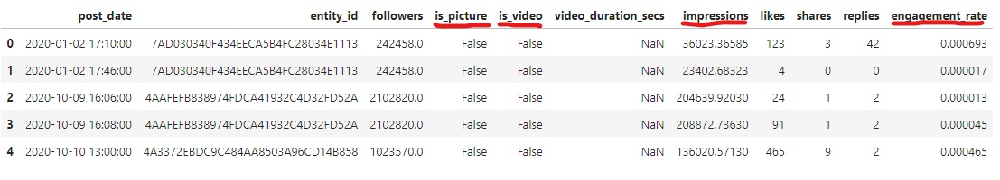
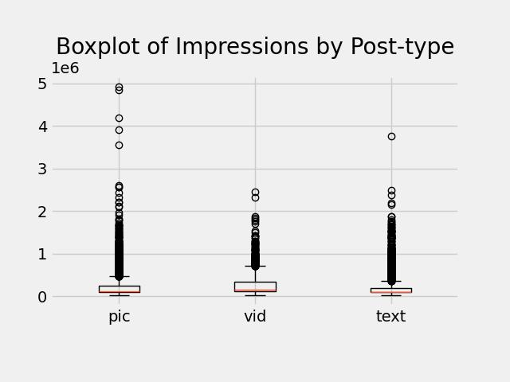
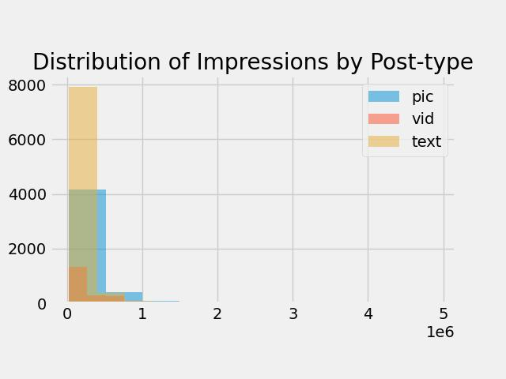
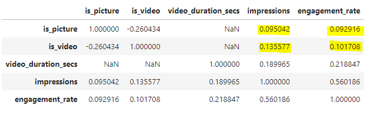
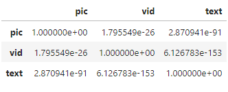
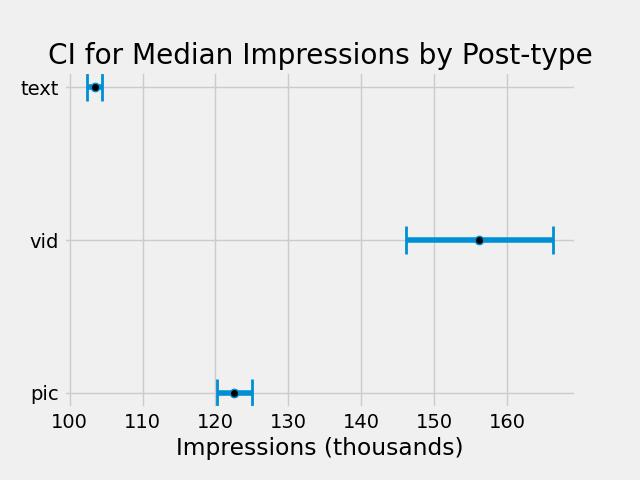
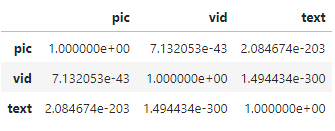
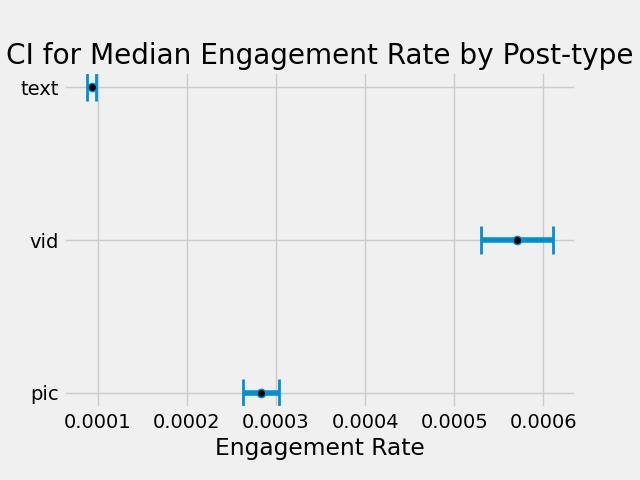

# Report

## Question:  How do impressions and engagement rate vary by post type?

### The Dataset

To answer this question we first need to understand what data we have available. A cursory glance show that we have 10 columns but only 4 that really matter for this problem. `is_picture`, `is_video`, `impressions`, and `engagement_rate`.

The first two are necessary as they define the groups of posts (picture, video, text if neither is true) and the last two are the KPIs in question. Lets see a brief summary of impressions by `post_type`.

The scale isn't great so it's hard to really say anything about the data. What about the distribution of impression by `post_type`?

The groups seem to roughly look similar and they're all right skew, but this still doesn't tell us much about the relationship between `post_type` and `impressions`. Lets check there correlation.

From the correlation matrix, it seems that containing a picture or video is NOT highly correlated with either impressions or engagement rate. Is there a difference at all?

### Hypothesis Testing

To test for a difference in means between more than two groups it's common to use ANOVA; however, we can't use ANOVA here because 2 assumptions are violated (normality & equality of variances). I tested with a Shapiro-Wilk test and a Levene test and they both return a p-value significantly smaller than .05. Instead I opted to use the Kruskal-Wallis test which test for differences in medians. The resultant p-value was also far smaller then our alpha level (.05) so the medians between the groups are different. Following the results I ran a post-hoc test. More specifically it was the Dunn test, which again test for differences in the medians between all pairs of groups. I chose to use this post-hoc test as it controls the family error rate when doing the pair-wise comparisons. The results are the following:

### Results

All post types have statistically significant differences in medians. How different are they? I bootstrapped each median 10000 times and created a 95 % confidence interval for each. Here are the results: 

The median impressions for posts with videos is between ~150k and ~170k. The median impressions for posts with pictures is between ~120k and ~125k. Finally the median impressions for text only posts is between ~102k - ~104k. Visually this looks like:

Clearly posts with videos outpreform all other kinds of posts. Does this relationship hold true for engagement rate? I re-did the whole process with engagement rate and got the following results from the Dunn test:

Then I bootstrapped the medians and got:

The results for engagement rate mirror what we got for impressions. Video posts far outpreform picture posts and text posts. And text posts do quite worse than picture and video.

## Recommendations

From the analysis I've conducted, it appears that the median engagement rate and impressions are greater in posts that contain videos. We ought to include videos in posts when possible and avoid purely text posts when possible as they preform the worst by far.